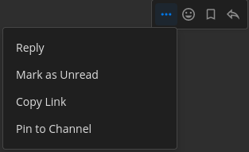

# Spam Reaction Mattermost :rofl:

This is a funny project for adding a huge number of reactions on a post in mattermost :laughing::laughing::laughing:. Don't use it for bad purpose :scream:

## Installation

### Pre-build binary

You can directly download binary from [releases page](https://github.com/tiena2cva/spam_reaction_mattermost/releases/latest). Currently, this tool supports for Linux, Windows and MacOS. Download zip file, extract and have fun :innocent:

### Build from source

If you want to build this tool by yourself, follow the instructions below:

#### Requirements

- [git](https://git-scm.com/)
- [golang](https://golang.org/) version 1.16+

#### Building 

```
git clone https://github.com/tiena2cva/spam_reaction_mattermost
cd spam_reaction_mattermost
go build ./...
```

After a few seconds, file `react` will appear, which is the binary file you need :hugs:

## Usage

```
Usage:  ./react [options] post_link
post_link: Link of post you want to spam reaction =))
Options:
  -email string
        Mattermost login email
  -file string
        File contain mattermost login email and password. Support json and yaml type
  -n int
        Number of reaction you want to add. Set 0 to use max supported emoji (default 20)
  -pass string
        Mattermost login password
Login using certificate file or email+pass
```

For login, you can enter your email and password via command line argument or you can use a certificate file (Save time for multiple use :rofl:). There are 2 types of supported certificate: `json` and `yaml`. You can view the content of example file in [sample.json](sample.json) and [sample.yaml](sample.yaml).

About the post link, you can get it by clicking on `More actions` button on a post and clicking `Copy link`. The link of the post will be copied on clipboard.



Also, you can set the number of reactions to use by passing -n argument

Example:

```
./react -f cert.json -n 30 http://localhost/bod/pl/jkbzhub6sbgj7dwkxju9tikjye
```

## Performance

I have tested in my computer and the tool can add 1800+ emojis in ~40s, so the rate is approximate 45 emojis per second. Not bad :laughing: :laughing:

In my emoji list (generated from [GitHub Emoji API](https://api.github.com/emojis)), not all of them are supported by mattermost. When I call `add reaction API` with un-supported emoji, I still got status code 200 :scream: I can't filter what emojis are supported and what aren't.

---

Hope you enjoy this tool and have funny moment with your friends :kissing_heart:
